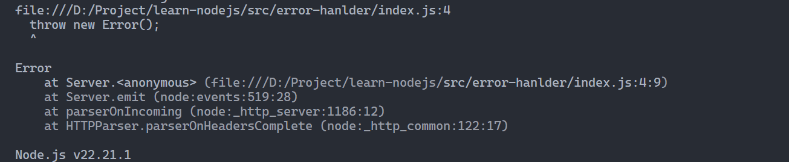

- 阻塞IO与非阻塞IO
	- Node服务采用一个**长期运行**的进程（进程中拥有大量的共享状态），所有请求会共享一个进程，因此潜在的共享变量会成为bug的隐藏处。而Apache+mod_php会为每个请求建立相应的线程。
	- **事件轮询**机制
		- **文件描述符**是一个抽象的句柄，存有**对打开文件**、**socket**、**管道**等的引用。
	- Node使用**单线程**，负载复杂的情况下会阻塞事件循环。
	- 非阻塞IO保证了在**数据库链接**、**硬盘访问**等操作时，主线程不会被挂起。
	- Node中的**错误处理**
		- Node中的异常处理
		  collapsed:: true
			- 在HTTP请求中，某个回调函数发生错误，整个进程都会发生错误。
			  ```javascript
			  import http from 'node:http';
			  
			  const server = http.createServer((req, res) => {
			    throw new Error('This will be uncacaught');
			  });
			  
			  server.listen(3000);
			  ```
			- 未捕获的错误会导致整个进程崩溃，此时进程退出。
			  
			- 如果添加了`uncaughtException`事件，此时进程就不会退出，需要手动处理
			  ```javascript
			  process.on('uncaughtException', (err) => {
			    console.log(err.message);
			    process.exit(-1); // 手动退出
			  });
			  ```
		- ``error事件回调
		  collapsed:: true
			- 通常`http`、`net`等原生模块中都会分发`error`事件，如果该事件未处理就会抛出**未捕获异常**
			  ```javascript
			  const server = net.createServer();
			  
			  server.on('connection', (socket) => {
			    socket.on('data', (data) => {
			      console.log('data: ', data.toString());
			      socket.write('hello client\n');
			      // 在这个地方要注意Node中事件机制和异常冒泡机制是分开的
			      // 此处异常为同步操作，同步抛出的异常会沿调用栈向上冒泡，直接到被try...catch块捕获。
			      // 如果没被捕获就会被变成uncaughtException，从而导致Node进程崩溃
			      // throw new Error('this is a error');
			      socket.emit('error', new Error('this is a error'));
			    });
			    // 注册一个error事件回调，但不会自动包裹其他事件回调函数抛出的异常
			    // 通常由socket.emit函数显式触发，或由底层网络错误触发。
			    socket.on('error', (err) => {
			      console.log('socket error: ', err.message);
			    });
			  });
			  
			  server.on('error', (err) => {
			    console.log('server error: ', err.message);
			  });
			  ```
- 特性：事件机制、异步 IO
- 模块：在 Node 环境中，一个文件便是一个模块，文件路径即是模块名。
  collapsed:: true
	- `commonjs`，node 原生模块加载机制，
		- 三个原生预定义变量：
			- `require` 用于加载和使用其他模块。
			- `exports` 用于导出模块中的公共属性和方法`exports.hello = function() {}`。
			- `module` 用于访问当前模块相关信息，最常用的用途是**替换当前模块的导出对象`module.exports = {}`**，默认导出对象会被替换一个`{}`。
		- 模块初始化：
			- 一个模块中的 JS 代码**仅在模块第一次被 require**时被执行，并初始化被导出的对象，之后，**缓存**起来可被重复利用。
		- 主模块
			- 通过命令行参数传递给 Node 执行的模块被称为主模块。
	- `es module`，
	-
- Node 模块路径解析规则，require支持相对或绝对路径导入：
  collapsed:: true
	- 内置模块
	- `node_modules`，用于存在 node 包，node 会尝试当前`package.json`所在模块加载，如果没找到则向上一级目录，直至跟目录为止。
	- `NODE_PATH`环境变量，Node 允许指定`NODE_PATH`环境变量指定额外的模块搜索路径，可指定一个或多个目录路径（Linux 下使用`:`分割，Windows 下使用`;`分割）。
- package（包）
  collapsed:: true
	- 在node中自定义模块，需要在项目根目录中创建`package.json` 文件
	  collapsed:: true
		- ```json
		  {
		    "name": "package name",
		    "mian": "./lib/index.js" // 指定入口模块文件
		  }
		  ```
		- `package.json`文件作用：
			- `main`字段：指定包的入口文件
			- `bin`字段：用于指定可执行脚本或二进制文件
				- `npm link` 自动连接到全局
				- `npm uninstall -g` 撤回操作
			-
	- 命令行程序
	  collapsed:: true
		- 在 Linux 系统中，可以把 JS 脚本当做 Shell 脚本运行
			-
			- ```javascript
			  #! /usr/bin/env node
			  // #! 注释是用来指定当前脚本使用的解析器。
			  // Nodejs 会自动忽略掉#!注释
			  ```
			- `chmod +x /home/user/bin/node-echo` 赋予脚本执行权限
		- 在 Window 系统中需要使用`cmd`文件解决
			- ```cmd
			  @node "C:\User\user\bin\node-echo.js" %*
			  ```
	- `NPM`，npm 是随 node 一起安装的**包管理工具**
	  collapsed:: true
		- 应用场景：
			- 允许用户从 npm 服务器上下载第三方包到本地；
			- 允许用户从 npm 服务器上下载第三方命令行到本地；
			- 允许用户将自己的包或命令行上传到 npm 或私人服务器上；
- 文件操作
- 网络操作
- 进程管理